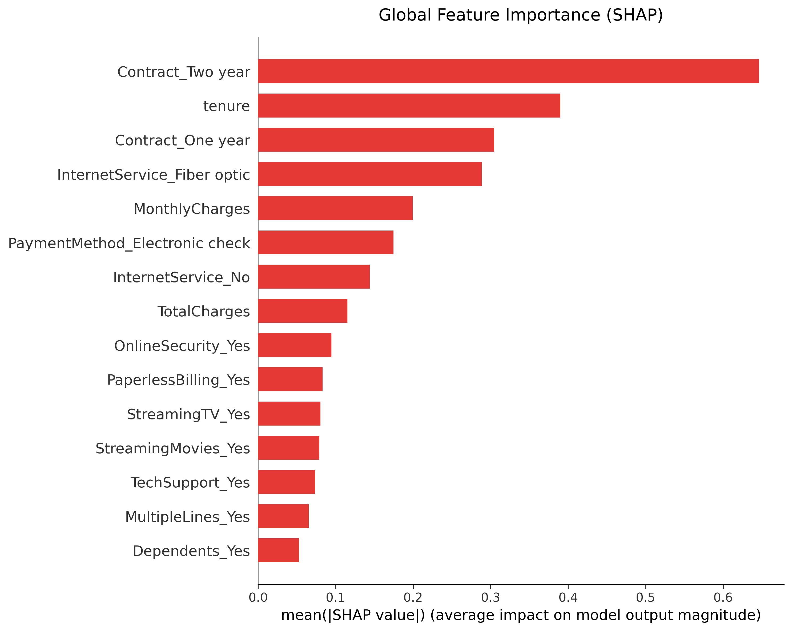
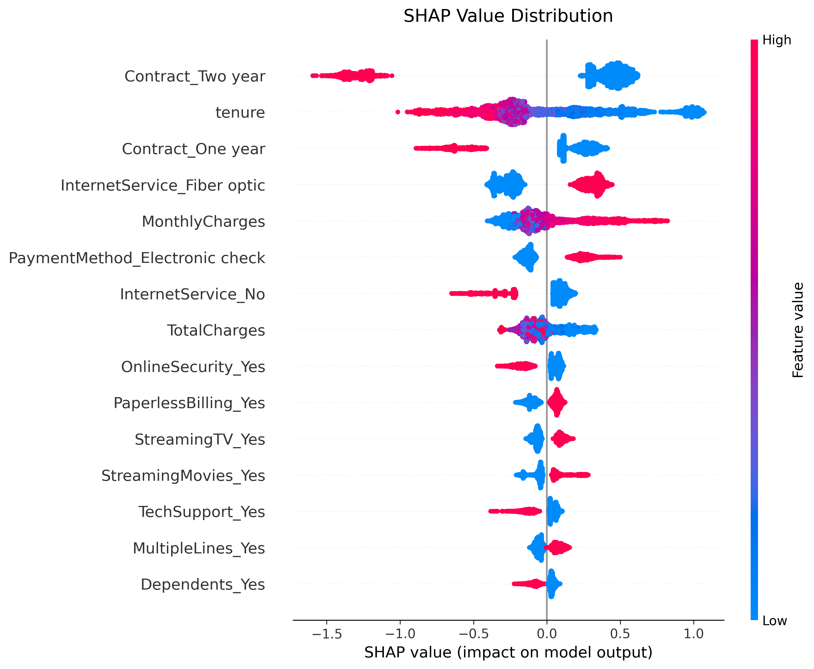

# Telecom Customer Churn Prediction

An end-to-end machine learning project that predicts whether a telecom customer is likely to churn using an optimized **LightGBM** classifier. The project covers data preprocessing, exploratory analysis, hyperparameter optimization with **Optuna**, decision threshold optimization, model explainability using **SHAP**, and deployment through an interactive **Streamlit** application.

## Live Demo

**Streamlit App:** https://telecom-customer-churn-prediction-jayed.streamlit.app/

---

## Project Overview

Customer churn is one of the most important business problems in the telecommunications industry. This project builds a production-ready classification pipeline capable of identifying customers at high risk of leaving the service.

The complete workflow includes:

- Data cleaning and preprocessing
- Feature engineering
- Baseline model development
- Hyperparameter optimization using Optuna
- Threshold optimization for business-oriented decision making
- Model explainability using SHAP
- Interactive Streamlit deployment

---

## Dataset

**Dataset:** Telco Customer Churn Dataset

The dataset contains customer demographics, subscription information, billing behavior, and service usage collected from a telecommunications company.

### Target Variable

- **Churn**
  - 1 → Customer churned
  - 0 → Customer retained

---

## Technologies Used

- Python
- Pandas
- NumPy
- Scikit-learn
- LightGBM
- Optuna
- SHAP
- Streamlit
- Matplotlib

---

## Machine Learning Pipeline

### Data Preprocessing

- Missing value handling
- Data type conversion
- One-hot encoding
- Feature validation
- Standardization of numerical variables

### Models Evaluated

- Logistic Regression
- Decision Tree
- Random Forest
- XGBoost
- CatBoost
- **LightGBM (Final Model)**

### Hyperparameter Optimization

- Optuna
- TPESampler
- 5-Fold Stratified Cross Validation
- ROC-AUC optimization

### Model Explainability

- SHAP Global Feature Importance
- SHAP Beeswarm Plot

---

## Final Model Performance

| Metric | Score |
|---------|------:|
| ROC-AUC | **0.8430** |
| Precision | **0.57** |
| Recall | **0.71** |
| F1-Score | **0.63** |

> Decision threshold optimized using a validation set to improve business-oriented classification performance.

---

## Repository Structure

```
telecom-customer-churn-prediction/
│
├── app.py
├── requirements.txt
├── README.md
├── LICENSE
│
├── notebook/
│   └── telecom_customer_churn_prediction.ipynb
│
├── model/
│   └── lightgbm_churn_production.pkl
│
└── assets/
    ├── shap_feature_importance.png
    └── shap_beeswarm_plot.png
```

---

## Running the Project

### Clone the repository

```bash
git clone https://github.com/Jayed08/telecom-customer-churn-prediction/

cd telecom-customer-churn-prediction
```

### Install dependencies

```bash
pip install -r requirements.txt
```

### Launch the Streamlit application

```bash
streamlit run app.py
```

---

## Model Explainability

The project uses **SHAP** to interpret model predictions.

### Global Feature Importance

Shows which features contribute the most to churn prediction across the entire dataset.



---

### SHAP Value Distribution

Illustrates how each feature influences individual predictions and whether it increases or decreases churn probability.



---

## Key Features

- End-to-end machine learning workflow
- Production-ready LightGBM model
- Hyperparameter tuning with Optuna
- Threshold optimization
- SHAP explainability
- Interactive Streamlit dashboard
- Clean and modular project structure

---

## Future Improvements

- Probability calibration
- Automated retraining pipeline
- Model monitoring
- Docker containerization
- Cloud deployment

---

## License

This project is licensed under the MIT License.

The dataset used in this project is subject to its original license and terms of use provided by the dataset author.

---

## Author

**Jayed Ansari**

GitHub: https://github.com/Jayed08

LinkedIn: https://www.linkedin.com/in/jayedansari2005/
